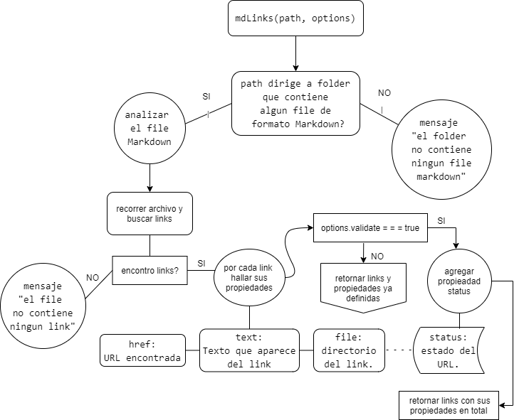

# mdLinks
> Lee y analiza archivos en formato Markdown, para verificar los links que contengan y reportar algunas estadísticas.

__Content__
- [Diagrama de flujo] (#diagrama-de-flujo)
- [Pseudo Codigo] (#pseudo-Codigo)
- [Boilerplate] (#boilerplate)
- [Install] (#install)
- [Uso] (#usage-examples)
  - [JavaScript API] (#javaScript-api)
  - [CLI] (#cli)
### DIAGRAMA DE FLUJO

### PSEUDO CODIGO
```text
const checkMdFiles = require(funcion que analiza mi archivo Markdown);
mdLinks(path, options)
new promise (resolve, reject) => {
if(el folder contiene algun file de formado Markdown) {
  resolve(checkMdFiles(array de files markdown)*)
} else {
  reject(console.log('el archino no es de formato Markdown'))
}
}
*checkMdFiles(array de files markdown) {
 Por cada file obtener sus propiedades:
   { href: URL encontrada,
     text: Texto que apare dentro del    link,
     file: Ruta del archivo donde se encontró el link.}
    let links =  Array de objetos
    options.validate ? links.forEach((link) => {
      verificar si es valido
      link.status =  estado de la respuesta recibida a la petición HTTP de la  URL.
      link.performance = (() => {
        if (link.status !== 400) {
          return 'ok'
        } else {
          return 'fail'
        }
      })();
      return links
    }): return links
}
```
### BOILERPLATE
```text
.
├── README.md
├── package.json
├── package-lock.json
├── .gitignore
├── src
|  ├── mdLinks.js
|  ├── cli.js
|  └── checkMdFiles.js
└── test
   └── test.js
```

## INSTALL
``` set up

npm install --global fiorellaCS01/LIM012-fe-md-links

```

### USAGE EXAMPLES

### JavaScript API
#### `mdLinks(path, options)`

##### Argumentos

- `path`: Ruta absoluta o relativa al archivo o directorio.
- `options`: Un objeto con las siguientes propiedades:
  * `validate`: Booleano que determina si se desea validar los links
    encontrados.

```js
const mdLinks = require("md-links");

mdLinks("./some/example.md")
  .then(links => {
    // => [{ href, text, file }]
  })
  .catch(console.error);

mdLinks("./some/example.md", { validate: true })
  .then(links => {
    // => [{ href, text, file, status, ok }]
  })
  .catch(console.error);
```

### CLI
Se ejecuta de la siguiente manera a través de la terminal:

`md-links <path-to-file> [options]`

```cli
$ md-links ./some/example.md
./some/example.md http://algo.com/2/3/ Link a algo
./some/example.md https://otra-cosa.net/algun-doc.html algún doc
./some/example.md http://google.com/ Google
```
Por defecto no valida si las URLs responden ok o no, solo identifica el archivo markdown, lo analiza e imprime los links que vaya encontrando, junto con la ruta del archivo donde aparece y el texto que hay dentro del link.

#### Options

##### `--validate`

Con la opción `--validate`, el módulo hace una petición HTTP para
averiguar si el link funciona o no.

``` validate
$ md-links ./some/example.md --validate
./some/example.md http://algo.com/2/3/ ok 200 Link a algo
./some/example.md https://otra-cosa.net/algun-doc.html fail 404 algún doc
./some/example.md http://google.com/ ok 301 Google
```

El output en este caso incluye la palabra `ok` o `fail` después de
la URL, así como el status de la respuesta recibida a la petición HTTP a dicha URL.

##### `--stats`

Con la opción `--stats` el output será un texto con estadísticas
básicas sobre los links.

```sh
$ md-links ./some/example.md --stats
Total: 3
Unique: 3
```

También se puede combinar `--stats` y `--validate` para obtener estadísticas que
necesiten de los resultados de la validación.

```sh
$ md-links ./some/example.md --stats --validate
Total: 3
Unique: 3
Broken: 1
```
