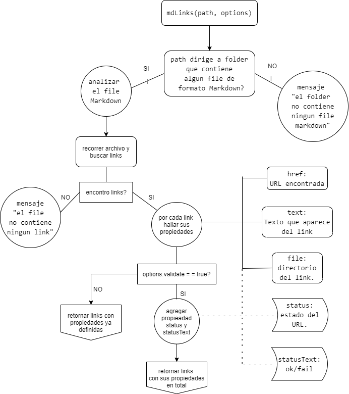
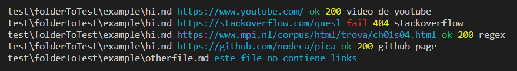
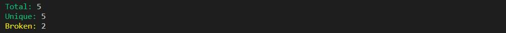

# mdLinks
> Lee y analiza archivos en formato Markdown, para verificar los links que contengan y reportar algunas estadísticas.

__Content__
- [Diagrama de flujo](#diagrama-de-flujo)
- [Boilerplate](#boilerplate)
- [Install](#install)
- [Uso](#ejemplo-de-uso)
  - [JavaScript API](#javaScript-api)
  - [CLI](#cli)
### DIAGRAMA DE FLUJO

### BOILERPLATE
```text
.
├── README.md
├── package.json
├── package-lock.json
├── .gitignore
├── src
|  ├── mdLinks.js
|  ├── cli.js
|  └── mdFile.js
|  └── validate.js
└── test
   └── test.js
```

## INSTALL
``` set up

npm install --global FiorellaChilcon/LIM012-fe-md-links

```

### EJEMPLOS DE USO

### JavaScript API
#### `mdLinks(path, options)`

##### Argumentos

- `path`: Ruta absoluta o relativa al archivo o directorio.
- `options`: Un objeto con las siguientes propiedades:
  * `validate`: Booleano que determina si se desea validar los links
    encontrados.

```js
const mdLinks = require("md-links");

mdLinks("./some/example.md")
  .then(links => {
    // => [{ href, text, file }]
  })
  .catch(console.error);

mdLinks("./some/example.md", { validate: true })
  .then(links => {
    // => [{ href, text, file, status, ok }]
  })
  .catch(console.error);
```

### CLI
Se ejecuta de la siguiente manera a través de la terminal:

```
$ md-links test/folderToTest/example
```


Por defecto no valida si las URLs responden ok o no, solo identifica el archivo markdown, lo analiza e imprime los links que vaya encontrando, junto con la ruta del archivo donde aparece y el texto que hay dentro del link.

#### Options

##### `--validate`

Con la opción `--validate`, el módulo hace una petición HTTP para
averiguar si el link funciona o no.

```
$ md-links test/folderToTest/example --validate
```



El output en este caso incluye la palabra `ok` o `fail` después de
la URL, así como el status de la respuesta recibida a la petición HTTP a dicha URL.

##### `--stats`

Con la opción `--stats` el output será un texto con estadísticas
básicas sobre los links.

```
$ md-links ./some/example.md --stats
```


También se puede combinar `--stats` y `--validate` para obtener estadísticas que
necesiten de los resultados de la validación.


```
$ md-links ./some/example.md --stats --validate
```



##### `--help`

```
md-links --help
```
Con esta opción obtienes una guía de como usar las opciones disponibles.
